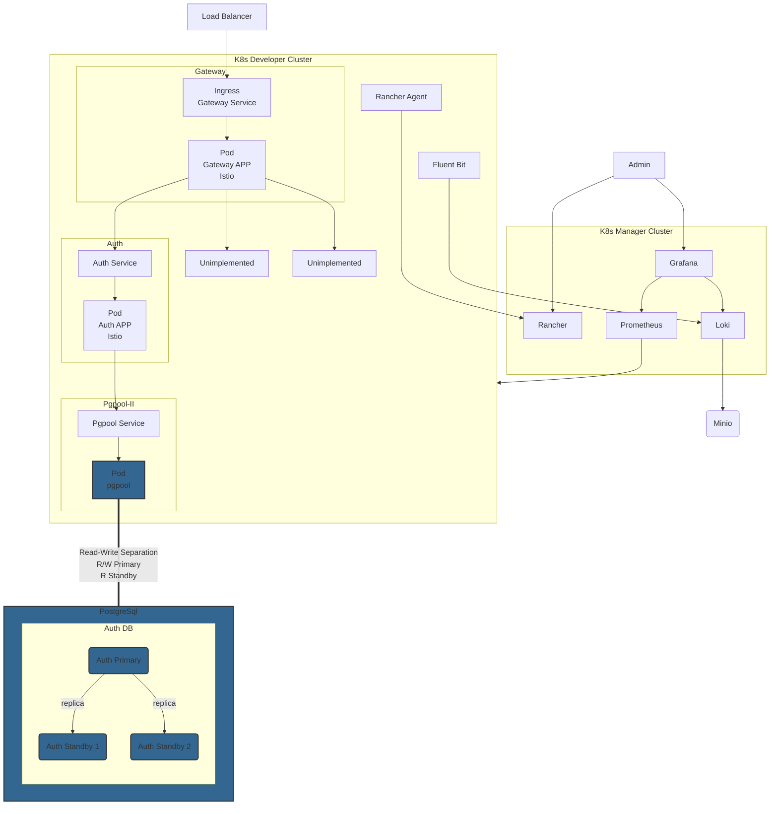

# ReddService

[](https://github.com/reddtsai/reddservice/actions)

從零開始微服務，完整實現從環境架設，到微服務設計、開發、測試、部署與維運的全過程。

## Architecture

### K8s



## Requirement

這是一個搬磚的過程，重現獨自建立本機雲或公司私有雲的步驟。

> Use [Projects](https://github.com/users/reddtsai/projects/3) to plan and track requirements.

## Document

個人在開發和維護過程中，準備那些文件，或使用哪些工具來生成文件。

### Swagger

用於描述和記錄 API

### Mermaid

- Sequence Diagram：描述系統內部不同組件之間的交互；展示用戶與系統之間的交互過程。[Example](https://github.com/reddtsai/reddservice/tree/main/docs/sequence_diagram)

## Install

需要先安裝 Docker 和 K8s，建議使用 [K3D](https://github.com/reddtsai/educative/tree/main/lessons/k3d)。

### Docker

透過 docker compose 安裝微服務

```
make docker-compose-up
```

### K8s

透過 manifest 安裝微服務

```
kubectl apply -f deployments/kubernetes
```

## Test

### Unit Test

每個單元以 Golang 的 package 進行劃分，並在開發和持續集成（CI）階段進行測試。

> 針對單元測試，增加 -tags unittest。

單元測試過程中，使用模擬(Mock)方式與單元外相依物件互動。

> 由 `go generate` 產生 mock file。generate 還不支持 generic，請必免使用。

## CI/CD

### CI

Containerization，透過 github workflow 產生 APP docker container image
